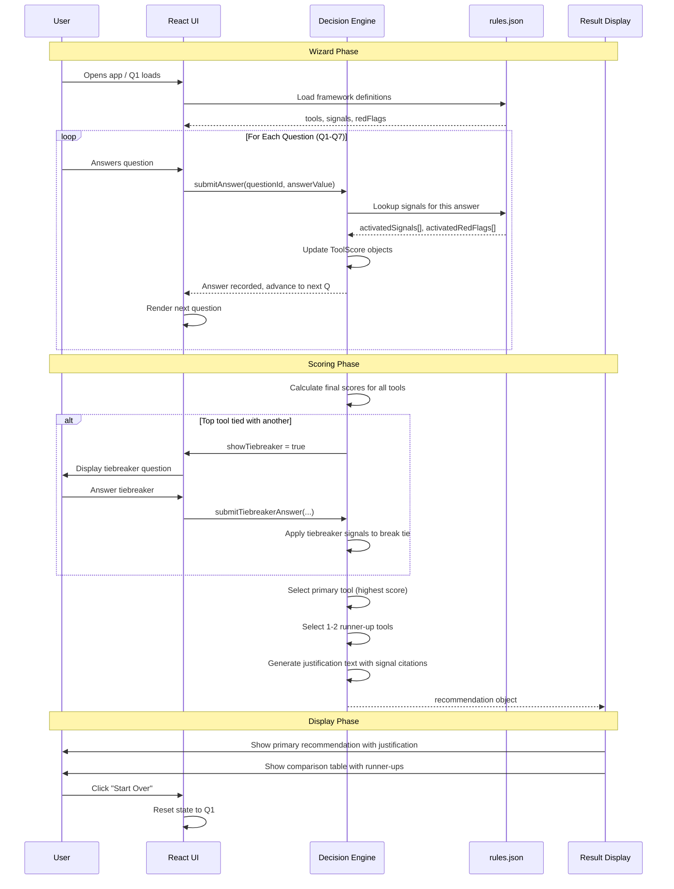

# Architecture Overview: Microsoft Tool Advisor

**Date**: 2025-09-01

## High-Level Architecture

The Microsoft Tool Advisor is a client-side single-page application built with React and Vite. It consists of three main layers:

1. **Presentation Layer** (React Components): User interface and interaction
2. **Decision Engine Layer** (Pure JavaScript): Recommendation logic and scoring
3. **Data Layer** (rules.json): Framework definitions and tool metadata

All computation happens in the browser; no backend or external services are required.

## System Architecture Diagram

```mermaid
graph TB
    subgraph "User Browser"
        direction TB
        
        subgraph "Presentation Layer"
            direction LR
            UI["React Components"]
            Input["Question Input"]
            Output["Recommendation Display"]
            UI --> Input
            UI --> Output
        end
        
        subgraph "Decision Engine"
            direction LR
            Engine["recommendationEngine.ts"]
            Scoring["Scoring Logic"]
            Score["Tool Scores"]
            Rank["Rank & Differentiate"]
            Justify["Generate Justification"]
            Engine --> Scoring
            Scoring --> Score
            Score --> Rank
            Rank --> Justify
        end
        
        subgraph "Data Layer"
            direction LR
            Rules["rules.json"]
            Tools["Tool Definitions"]
            Signals["Signals & Weights"]
            RedFlags["Red Flags & Weights"]
            Rules --> Tools
            Rules --> Signals
            Rules --> RedFlags
        end
        
        Input -->|User Answers| Engine
        Scoring -->|Retrieve Weights| Rules
        Justify -->|Output| Output
    end
    
    style "User Browser" fill:#e1f5ff
    style "Presentation Layer" fill:#fff3e0
    style "Decision Engine" fill:#f3e5f5
    style "Data Layer" fill:#e8f5e9
```

## Detailed Data Flow



## Component Hierarchy

```
App (root)
├── ErrorBoundary
│   └── WizardContainer (state: currentIndex, answers, recommendation, showTiebreaker)
│       ├── ProgressIndicator (props: currentIndex, totalQuestions)
│       ├── QuestionCard (props: question, onAnswer callback)
│       │   ├── Question text
│       │   ├── Options (radio, checkbox, etc.)
│       │   └── Submit button
│       └── RecommendationResult (props: recommendation, onRestart)
│           ├── Primary tool section
│           │   ├── Tool name (emphasized)
│           │   ├── Justification text
│           │   └── Metadata (questions answered, time)
│           ├── ComparisonTable (props: runnerUps[])
│           │   └── 1-2 runner-up tools with differentiation
│           └── "Start Over" button
```

## Core Modules

### 1. Presentation Layer: React Components

**Location**: `src/components/`

- **App.tsx**: Entry point, error boundary
- **WizardContainer.tsx**: State management for entire wizard flow
- **QuestionCard.tsx**: Single question display and input
- **ProgressIndicator.tsx**: Progress bar and question counter
- **RecommendationResult.tsx**: Results display
- **ComparisonTable.tsx**: Runner-up tools table

**Key Properties**:
- Pure components (no side effects)
- Props-based, easy to test
- Semantic HTML for accessibility

### 2. Decision Engine: Pure JavaScript Functions

**Location**: `src/engine/`

- **recommendationEngine.ts**: Main recommendation algorithm
  - `loadRules(rulesFile: RulesFile): void` — Load framework definitions
  - `processAnswer(question: Question, answer: Answer): ToolScore[]` — Update tool scores
  - `generateRecommendation(answers: Answer[]): Recommendation` — Compute recommendation
  - `detectTie(scores: ToolScore[]): boolean` — Check if tie exists
  - `breakTie(scores: ToolScore[], tiebreakerAnswer: Answer): ToolScore[]` — Apply tiebreaker

- **scoring.ts**: Scoring logic
  - `calculateToolScore(tool: Tool, activeSignals: Signal[], activeRedFlags: RedFlag[]): number` — Score a single tool
  - `rankTools(toolScores: ToolScore[]): ToolScore[]` — Sort by score

- **types.ts**: TypeScript interfaces
  - `Tool`, `Signal`, `RedFlag`, `Question`, `Answer`, `Recommendation`, etc.

**Key Properties**:
- Pure functions (no state mutation)
- No React dependencies
- Highly testable
- Deterministic (same input → same output)

### 3. Data Layer: Framework Definitions

**Location**: `src/data/`

- **rules.json**: Framework metadata
  - `version`: Schema version
  - `tools`: Array of Tool objects
  - `signals`: Array of Signal objects (best-fit indicators)
  - `redFlags`: Array of RedFlag objects (warning indicators)
  - `questions`: Array of Question objects (Q1-Q7 + tiebreaker)
  - `questionMappings`: Mapping of (questionId, answerValue) → signals/redFlags
  - `tiebreakers`: Tiebreaker configuration

**Source**: Manually curated from `docs/decision-framework.md`

**Responsibility**: Single source of truth for tool definitions and decision criteria

---

## State Management Flow

### Browser Session State

```
WizardContainer (React Component)
├── currentQuestionIndex: number (0-6 or 0-7 with tiebreaker)
├── answers: Answer[] (accumulated user responses)
├── recommendation: Recommendation | null (computed after final Q)
├── showTiebreaker: boolean (true if tie detected)
└── tiebreakerAnswer: Answer | null (user's tiebreaker response)
```

**Lifecycle**:
1. Initialize: `currentQuestionIndex = 0`, `answers = []`, `recommendation = null`
2. For each question: append Answer to answers[], increment currentQuestionIndex
3. After Q7: call recommendation engine
4. If tie: set `showTiebreaker = true`, wait for tiebreaker answer
5. If no tie: generate recommendation, set `recommendation = <object>`
6. Display recommendation, await user "Start Over" click
7. Reset all state to initial

### No Persistence

- State is session-scoped only
- Page reload → state lost
- No local storage, no backend storage
- Aligns with privacy requirement (no data tracking)

---

## Technology Stack

| Layer | Technology | Purpose |
|-------|-----------|---------|
| Frontend Framework | React 18+ | UI components, state management |
| Build Tool | Vite | Fast dev server, optimized builds |
| Language | TypeScript | Type safety, IDE support |
| Styling | CSS + Tailwind (if used) | Responsive design, theming |
| Testing | Vitest, React Testing Library, Playwright | Unit, integration, E2E tests |
| Bundling | Vite + Rollup | Production builds |

**Browser Support**: Modern browsers (ES2020+), mobile-responsive

---

## Offline Capability

**Requirement**: App must work without network connectivity.

**How It Works**:
1. `rules.json` is bundled with the application at build time
2. On app startup (browser loads HTML/JS/CSS), all assets are cached
3. `rules.json` is loaded from cache (no network call needed)
4. User can answer questions and get recommendations without internet
5. Subsequent sessions (after refresh): browser cache serves assets

**No Service Workers**: Not required for v1 (browser cache is sufficient)

---

## Security & Privacy

**No External Calls**:
- No analytics, no telemetry, no error reporting (v1)
- No calls to backend
- No user data transmitted

**No Storage**:
- No database
- No local storage (by design)
- No cookies (beyond session)

**Result**: Maximum privacy; users control their own data (lives in browser, lost on close).

---

## Extensibility

While v1 focuses on the five Microsoft tools, the architecture supports future extensions:

### Adding a New Tool

1. Add Tool definition to `rules.json`
2. Add associated Signals and RedFlags
3. Update QuestionMappings if questions need new options
4. Update tiebreaker configuration if needed
5. Recommendation engine works unchanged (tool-agnostic)

### Adding a New Question

1. Add Question to `rules.json`
2. Add QuestionMappings for each answer option
3. Update test fixtures
4. UI components work unchanged (questions are data-driven)

### Changing Recommendation Logic

1. Modify `recommendationEngine.ts` pure functions
2. No UI changes needed
3. Tests verify new logic against rules.json

---

## Performance Characteristics

| Metric | Target | Expected |
|--------|--------|----------|
| App startup | <2s | ~500ms (Vite + small bundle) |
| Question load | <100ms | ~10-50ms (React re-render) |
| Question answer submit | <100ms | ~5-20ms (scoring algorithm) |
| Recommendation generation | <100ms | ~20-50ms (complete scoring run) |
| Page responsiveness | 60 FPS | ~60 FPS (no heavy computation) |

**Bundle Size**:
- React + utilities: ~120KB (gzipped)
- App code + CSS: ~30KB (gzipped)
- Total: ~150KB (gzipped), ~500KB (uncompressed)

---

## Deployment

**Build Process**:
```bash
npm run build
→ Vite transpiles TS/JSX to JS
→ Minifies and tree-shakes
→ Outputs dist/ directory (static files)
```

**Hosting**:
- Static file hosting (GitHub Pages, Netlify, Vercel, S3, etc.)
- No server required
- No database required
- No API backend required

**Example (GitHub Pages)**:
```bash
npm run build
git add dist/
git commit -m "Build for production"
git push origin main
→ GitHub Pages serves dist/ automatically
```

---

## Testing Architecture

```
tests/
├── unit/                          # Pure function tests
│   ├── recommendationEngine.test.ts
│   ├── scoring.test.ts
│   └── rules.test.ts
├── integration/                   # React + Engine together
│   ├── wizard-flow.test.tsx
│   └── recommendation.test.tsx
└── e2e/                           # Full browser automation
    └── wizard.spec.ts
```

**Key Test Scenarios**:
1. **Scoring Logic**: Verify tool scores are calculated correctly for various signal/red flag combinations
2. **Recommendation**: Verify primary + runner-ups are selected correctly
3. **Wizard Flow**: Verify questions advance, answers are saved, state updates
4. **Accessibility**: Verify keyboard navigation, screen reader compatibility
5. **Offline**: Verify app works without network
6. **Tiebreaker**: Verify tiebreaker appears when top tools tie, resolves correctly

---

## Summary

The Microsoft Tool Advisor uses a **clean three-layer architecture**:

1. **Presentation (React)**: Interactive UI, user-friendly
2. **Decision Engine (Pure JS)**: Scoring algorithm, framework-grounded logic
3. **Data (rules.json)**: Framework definitions, tool metadata

**Key Benefits**:
- ✓ No backend complexity (client-side only)
- ✓ Fully testable (pure functions + React components)
- ✓ Privacy-respecting (no data transmission)
- ✓ Offline-capable (static assets)
- ✓ Extensible (tool-agnostic, data-driven)
- ✓ Accessible (semantic HTML, keyboard, screen reader)

**Constraints Respected**:
- ✓ Transparent decision logic (scoring is deterministic, citable)
- ✓ Client-side only (no backend, no API calls)
- ✓ Framework authority (rules.json is curated from docs/decision-framework.md)
- ✓ Accessible & responsive (WCAG 2.1 AA, mobile-friendly)
